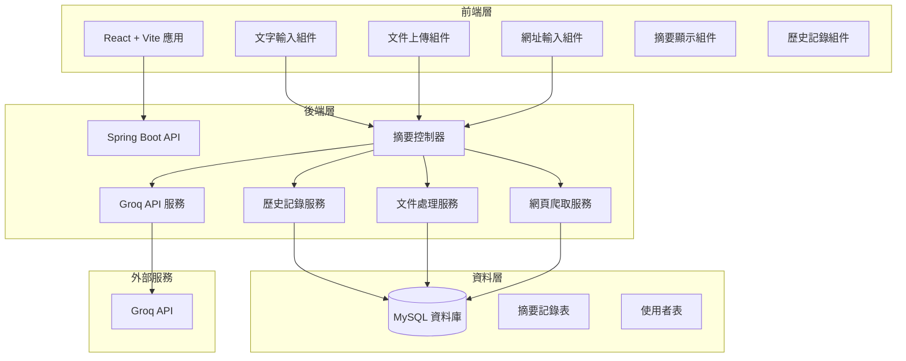
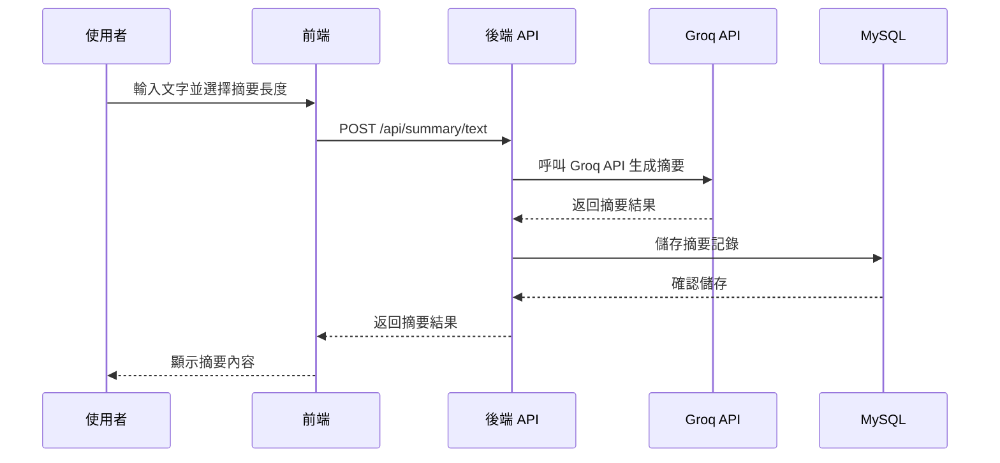
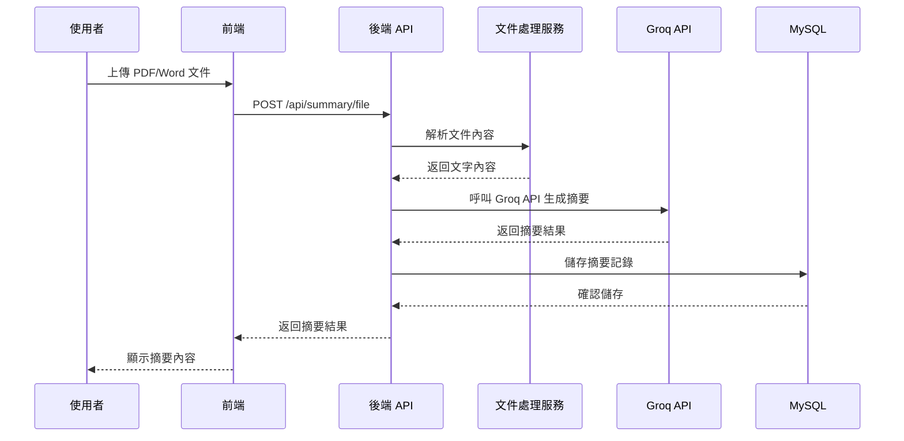
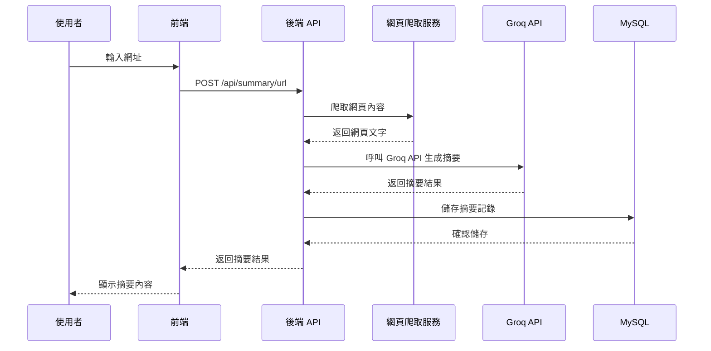

# AI 內容摘要工具 - 系統架構規劃

## 專案概述

這是一個全端 AI 內容摘要工具，支援多種輸入方式（文字、文件上傳、網址），使用 Groq API 生成智能摘要，並提供歷史記錄管理功能。

## 技術棧

### 前端
- **框架**: React 18
- **建置工具**: Vite
- **語言**: JavaScript (ES6+)
- **UI 框架**: Ant Design / Material-UI
- **狀態管理**: React Context API / Zustand
- **HTTP 客戶端**: Axios
- **路由**: React Router v6
- **樣式**: CSS Modules / Styled Components

### 後端
- **框架**: Spring Boot 3.x
- **語言**: Java 17+
- **建置工具**: Maven
- **資料庫**: MySQL 8.0
- **ORM**: Spring Data JPA (Hibernate)
- **API 文檔**: SpringDoc OpenAPI (Swagger)
- **安全**: Spring Security (可選)

### 第三方服務
- **AI 服務**: Groq API
- **文件解析**: Apache POI (Word), Apache PDFBox (PDF)
- **網頁爬取**: Jsoup

## 系統架構圖



## 資料庫設計

### 表結構

#### 1. summary_records (摘要記錄表)
```sql
CREATE TABLE summary_records (
    id BIGINT PRIMARY KEY AUTO_INCREMENT,
    source_type VARCHAR(20) NOT NULL COMMENT '來源類型: TEXT, FILE, URL',
    source_content TEXT COMMENT '原始內容或文件路徑',
    source_url VARCHAR(500) COMMENT '網址來源',
    file_name VARCHAR(255) COMMENT '文件名稱',
    summary_text TEXT NOT NULL COMMENT '摘要內容',
    summary_length VARCHAR(20) COMMENT '摘要長度: SHORT, MEDIUM, LONG',
    model_used VARCHAR(50) COMMENT '使用的 Groq 模型',
    tokens_used INT COMMENT '使用的 token 數量',
    created_at TIMESTAMP DEFAULT CURRENT_TIMESTAMP,
    updated_at TIMESTAMP DEFAULT CURRENT_TIMESTAMP ON UPDATE CURRENT_TIMESTAMP,
    INDEX idx_source_type (source_type),
    INDEX idx_created_at (created_at)
) ENGINE=InnoDB DEFAULT CHARSET=utf8mb4 COLLATE=utf8mb4_unicode_ci;
```

#### 2. users (使用者表 - 可選)
```sql
CREATE TABLE users (
    id BIGINT PRIMARY KEY AUTO_INCREMENT,
    username VARCHAR(50) UNIQUE NOT NULL,
    email VARCHAR(100) UNIQUE NOT NULL,
    created_at TIMESTAMP DEFAULT CURRENT_TIMESTAMP,
    updated_at TIMESTAMP DEFAULT CURRENT_TIMESTAMP ON UPDATE CURRENT_TIMESTAMP
) ENGINE=InnoDB DEFAULT CHARSET=utf8mb4 COLLATE=utf8mb4_unicode_ci;
```

## API 端點設計

### 摘要相關 API

#### 1. 文字摘要
```
POST /api/summary/text
Content-Type: application/json

Request:
{
  "content": "要摘要的文字內容",
  "summaryLength": "MEDIUM",  // SHORT, MEDIUM, LONG
  "language": "zh-TW"
}

Response:
{
  "id": 1,
  "summary": "生成的摘要內容",
  "tokensUsed": 150,
  "createdAt": "2025-12-21T09:00:00"
}
```

#### 2. 文件上傳摘要
```
POST /api/summary/file
Content-Type: multipart/form-data

Request:
- file: [PDF/Word 文件]
- summaryLength: MEDIUM
- language: zh-TW

Response:
{
  "id": 2,
  "fileName": "document.pdf",
  "summary": "生成的摘要內容",
  "tokensUsed": 200,
  "createdAt": "2025-12-21T09:00:00"
}
```

#### 3. 網址摘要
```
POST /api/summary/url
Content-Type: application/json

Request:
{
  "url": "https://example.com/article",
  "summaryLength": "MEDIUM",
  "language": "zh-TW"
}

Response:
{
  "id": 3,
  "url": "https://example.com/article",
  "title": "網頁標題",
  "summary": "生成的摘要內容",
  "tokensUsed": 180,
  "createdAt": "2025-12-21T09:00:00"
}
```

#### 4. 獲取歷史記錄
```
GET /api/summary/history?page=0&size=10&sourceType=ALL

Response:
{
  "content": [
    {
      "id": 1,
      "sourceType": "TEXT",
      "summary": "摘要內容",
      "createdAt": "2025-12-21T09:00:00"
    }
  ],
  "totalElements": 50,
  "totalPages": 5,
  "currentPage": 0
}
```

#### 5. 獲取單一記錄詳情
```
GET /api/summary/{id}

Response:
{
  "id": 1,
  "sourceType": "TEXT",
  "sourceContent": "原始內容",
  "summary": "摘要內容",
  "summaryLength": "MEDIUM",
  "tokensUsed": 150,
  "createdAt": "2025-12-21T09:00:00"
}
```

#### 6. 刪除記錄
```
DELETE /api/summary/{id}

Response:
{
  "message": "記錄已刪除"
}
```

## 前端組件結構

```
frontend/
├── src/
│   ├── components/
│   │   ├── Layout/
│   │   │   ├── Header.jsx
│   │   │   ├── Footer.jsx
│   │   │   └── Sidebar.jsx
│   │   ├── Summary/
│   │   │   ├── TextInput.jsx          # 文字輸入組件
│   │   │   ├── FileUpload.jsx         # 文件上傳組件
│   │   │   ├── UrlInput.jsx           # 網址輸入組件
│   │   │   ├── SummaryDisplay.jsx     # 摘要顯示組件
│   │   │   ├── SummaryOptions.jsx     # 摘要選項（長度選擇）
│   │   │   └── LoadingSpinner.jsx     # 載入動畫
│   │   └── History/
│   │       ├── HistoryList.jsx        # 歷史記錄列表
│   │       ├── HistoryItem.jsx        # 單一記錄項目
│   │       └── HistoryFilter.jsx      # 篩選器
│   ├── pages/
│   │   ├── Home.jsx                   # 首頁
│   │   ├── SummaryPage.jsx            # 摘要生成頁面
│   │   └── HistoryPage.jsx            # 歷史記錄頁面
│   ├── services/
│   │   └── api.js                     # API 服務封裝
│   ├── hooks/
│   │   ├── useSummary.js              # 摘要相關 Hook
│   │   └── useHistory.js              # 歷史記錄 Hook
│   ├── context/
│   │   └── AppContext.jsx             # 全域狀態管理
│   ├── utils/
│   │   ├── constants.js               # 常數定義
│   │   └── helpers.js                 # 輔助函數
│   ├── App.jsx
│   └── main.jsx
```

## 後端專案結構

```
backend/
├── src/main/java/com/aipoint/summary/
│   ├── controller/
│   │   └── SummaryController.java     # 摘要 API 控制器
│   ├── service/
│   │   ├── SummaryService.java        # 摘要業務邏輯
│   │   ├── GroqApiService.java        # Groq API 整合
│   │   ├── FileProcessorService.java  # 文件處理服務
│   │   └── WebScraperService.java     # 網頁爬取服務
│   ├── model/
│   │   ├── entity/
│   │   │   └── SummaryRecord.java     # 摘要記錄實體
│   │   ├── dto/
│   │   │   ├── SummaryRequest.java    # 請求 DTO
│   │   │   └── SummaryResponse.java   # 回應 DTO
│   │   └── enums/
│   │       ├── SourceType.java        # 來源類型枚舉
│   │       └── SummaryLength.java     # 摘要長度枚舉
│   ├── repository/
│   │   └── SummaryRepository.java     # 資料存取層
│   ├── config/
│   │   ├── WebConfig.java             # Web 配置
│   │   ├── DatabaseConfig.java        # 資料庫配置
│   │   └── GroqConfig.java            # Groq API 配置
│   ├── exception/
│   │   ├── GlobalExceptionHandler.java
│   │   └── CustomExceptions.java
│   └── SummaryApplication.java        # 主程式
├── src/main/resources/
│   ├── application.yml                # 應用配置
│   └── application-dev.yml            # 開發環境配置
└── pom.xml
```

## 核心功能流程

### 1. 文字摘要流程


### 2. 文件上傳摘要流程


### 3. 網址摘要流程


## Groq API 整合方案

### 配置參數
```yaml
groq:
  api-key: ${GROQ_API_KEY}
  base-url: https://api.groq.com/openai/v1
  model: mixtral-8x7b-32768  # 或其他 Groq 支援的模型
  max-tokens: 1000
  temperature: 0.7
```

### 摘要長度對應
- **SHORT**: max_tokens = 150, 約 2-3 句話
- **MEDIUM**: max_tokens = 300, 約 1 段落
- **LONG**: max_tokens = 500, 約 2-3 段落

### Prompt 模板
```
請為以下內容生成一個{length}的摘要，使用繁體中文：

{content}

摘要要求：
1. 保留關鍵資訊和重點
2. 語句通順、邏輯清晰
3. 客觀中立的語氣
```

## 文件處理方案

### PDF 處理
- 使用 **Apache PDFBox** 提取文字
- 支援多頁 PDF
- 處理圖片中的文字（OCR 可選）

### Word 處理
- 使用 **Apache POI** 提取文字
- 支援 .doc 和 .docx 格式
- 保留基本格式資訊

### 文件大小限制
- 最大文件大小: 10MB
- 最大文字長度: 50,000 字元

## 網頁爬取方案

### 使用 Jsoup
```java
Document doc = Jsoup.connect(url)
    .userAgent("Mozilla/5.0")
    .timeout(10000)
    .get();
    
String title = doc.title();
String content = doc.select("article, .content, main").text();
```

### 爬取策略
1. 優先提取 `<article>` 標籤內容
2. 次選 `.content` 或 `main` 區域
3. 過濾廣告和導航元素
4. 限制內容長度避免過長

## 使用者介面設計

### 主要頁面

#### 1. 首頁 / 摘要生成頁面
- **頂部導航**: Logo、功能選單、歷史記錄連結
- **輸入區域**: 
  - Tab 切換（文字輸入 / 文件上傳 / 網址輸入）
  - 摘要長度選擇器（短 / 中 / 長）
  - 生成按鈕
- **輸出區域**: 
  - 摘要結果顯示
  - 複製按鈕
  - 儲存按鈕
  - Token 使用量顯示

#### 2. 歷史記錄頁面
- **篩選器**: 按來源類型、日期範圍篩選
- **記錄列表**: 
  - 卡片式顯示
  - 顯示摘要預覽、來源類型、時間
  - 查看詳情、刪除按鈕
- **分頁控制**: 頁碼、每頁數量選擇

### UI/UX 特點
- 響應式設計，支援桌面和移動裝置
- 深色/淺色主題切換
- 載入動畫和進度提示
- 錯誤提示和友善的錯誤訊息
- 快捷鍵支援（Ctrl+Enter 生成摘要）

## 開發環境配置

### 前端環境
```json
{
  "node": ">=18.0.0",
  "npm": ">=9.0.0"
}
```

### 後端環境
```xml
<properties>
    <java.version>17</java.version>
    <spring-boot.version>3.2.0</spring-boot.version>
</properties>
```

### 資料庫環境
- MySQL 8.0+
- 建議使用 Docker 容器運行

## 安全性考量

1. **API 金鑰保護**: 使用環境變數儲存 Groq API Key
2. **輸入驗證**: 驗證所有使用者輸入，防止 XSS 和 SQL Injection
3. **檔案上傳安全**: 限制文件類型和大小
4. **CORS 配置**: 正確配置跨域請求
5. **錯誤處理**: 不洩露敏感資訊的錯誤訊息

## 效能優化

1. **快取機制**: 對相同內容的摘要結果進行快取
2. **非同步處理**: 大文件處理使用非同步方式
3. **資料庫索引**: 在常用查詢欄位建立索引
4. **前端優化**: 
   - 程式碼分割（Code Splitting）
   - 懶載入（Lazy Loading）
   - 圖片優化

## 測試策略

### 前端測試
- 單元測試: Vitest
- 組件測試: React Testing Library
- E2E 測試: Playwright

### 後端測試
- 單元測試: JUnit 5
- 整合測試: Spring Boot Test
- API 測試: MockMvc

## 部署建議

### 本地開發部署
1. 使用 Docker Compose 統一管理服務
2. 前端開發伺服器: `npm run dev` (Port 5173)
3. 後端開發伺服器: `mvn spring-boot:run` (Port 8080)
4. MySQL: Docker 容器 (Port 3306)

### Docker Compose 配置
```yaml
version: '3.8'
services:
  mysql:
    image: mysql:8.0
    environment:
      MYSQL_ROOT_PASSWORD: root
      MYSQL_DATABASE: ai_summary
    ports:
      - "3306:3306"
  
  backend:
    build: ./backend
    ports:
      - "8080:8080"
    depends_on:
      - mysql
    environment:
      SPRING_DATASOURCE_URL: jdbc:mysql://mysql:3306/ai_summary
      GROQ_API_KEY: ${GROQ_API_KEY}
  
  frontend:
    build: ./frontend
    ports:
      - "5173:5173"
    depends_on:
      - backend
```

## 未來擴展方向

1. **多使用者支援**: 加入使用者認證和授權
2. **更多 AI 模型**: 支援切換不同的 AI 服務（OpenAI、Claude）
3. **批次處理**: 支援一次處理多個文件
4. **匯出功能**: 將摘要匯出為 PDF、Word
5. **分享功能**: 生成分享連結
6. **多語言支援**: 支援英文、日文等其他語言
7. **語音輸入**: 支援語音轉文字後摘要
8. **摘要比較**: 比較不同長度或模型的摘要結果

## 預估開發時程

此專案包含前後端完整功能開發，建議分階段進行：

### 第一階段：基礎架構
- 建立專案結構
- 配置開發環境
- 建立資料庫

### 第二階段：核心功能
- 實作文字摘要功能
- 整合 Groq API
- 基本前端介面

### 第三階段：進階功能
- 文件上傳處理
- 網頁爬取功能
- 歷史記錄管理

### 第四階段：優化與測試
- UI/UX 優化
- 效能優化
- 測試與除錯

---

**文檔版本**: 1.0  
**最後更新**: 2025-12-21  
**維護者**: AI Architect
